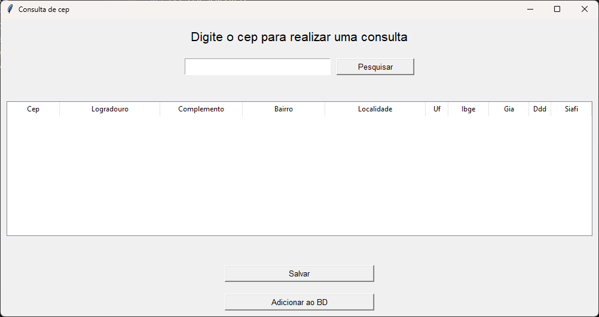
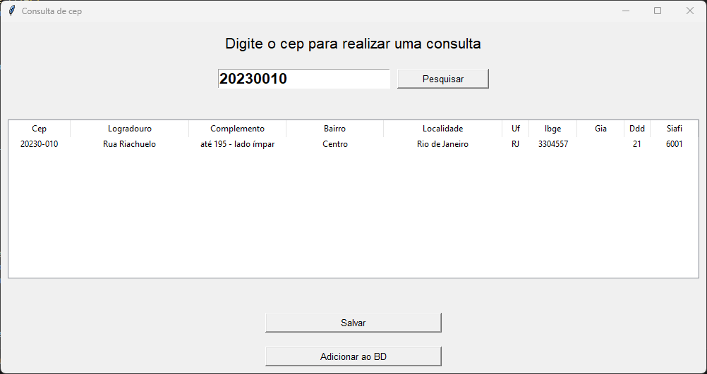

# Pesquisa de dados baseado no CEP

A proposta do repositório é servir como estudo sobre usos de APIs, mais precisamente sobre a api da [VIACEP](https://viacep.com.br/)

A ideia e a base do exercício veio do vídeo [
API de CEP e Busca de Endereços com Python](https://www.youtube.com/watch?v=m72WIejruxI) do canal do youtube [Hashtag Programação](https://www.youtube.com/@HashtagProgramacao)

Como mencionado, a ideia é fornecer os dados de uma requisição a API do viacep partindo de um cep digitado, o resultado sairia como uma tabela json semelhante a esta

```
JSON
URL: viacep.com.br/ws/01001000/json/

    {
      "cep": "01001-000",
      "logradouro": "Praça da Sé",
      "complemento": "lado ímpar",
      "unidade": "",
      "bairro": "Sé",
      "localidade": "São Paulo",
      "uf": "SP",
      "estado": "São Paulo",
      "regiao": "Sudeste",
      "ibge": "3550308",
      "gia": "1004",
      "ddd": "11",
      "siafi": "7107"
    }
          
```

O programa vai usar como referência  o cep digitado na interface, buscar da mesma forma que o exemplo acima faz, e exibir dentro da interface as informações fornecidas pela api

### Exemplo de execução :



_nota : A interface ainda não está 100% completa, ainda estou estudando como customizar interfaces no python_

Depois basta digitar o **Cep** que deseja **pesquisar**



No campo abaixo serão exibidos todos os dados fornecidos pela api, e caso deseje salvar, basta apertar o botão de salvar em baixo

O arquivo salvo também será em formato .json

### exemplo de arquivo gerado : 

